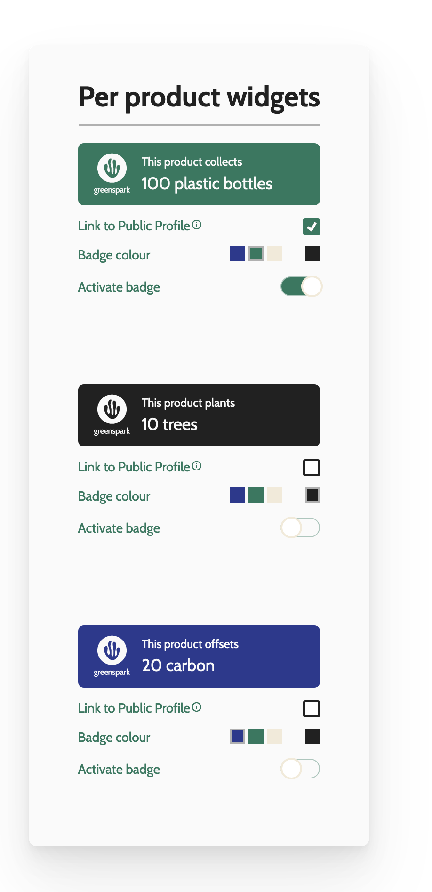
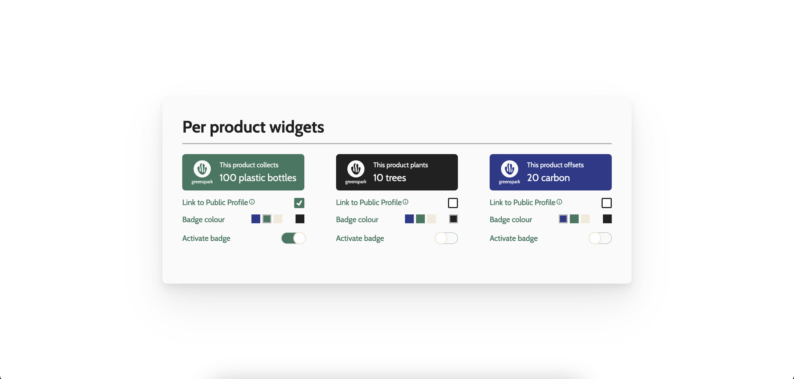

# Greenspark Product Widgets

My implementation of the product widgets task for Greenspark.

## Table of contents

- [Overview](#overview)
  - [The task](#the-task)
  - [Screenshots](#screenshots)
  - [Links](#links)
- [My process](#my-process)
  - [Built with](#built-with)
  - [Thought process](#thought-process)
  - [Challenges](#challenges)
- [Author](#author)

## Overview

### The task

##### Non-technical requirements:

- As a user I want to see my product widgets.
- As a user I want to customize my widgets by changing their colors, active state and
  whether it’s linked to my public profile (using client-side state management)
- Only one widget can have the active state at a time
- While there isn't a strict deadline, completing the homework should ideally take only a
  few hours. We hope to receive your solution within one week.

##### Technical requirements:

- You can find a Figma prototype for the UI design here. Please make sure that you sign
  up/login to Figma, so you can investigate the design details. We also recommend
  making a copy of the design for yourself.
- You can fetch the product widget DTOs and its initial properties from
  https://api.mocki.io/v2/016d11e8/product-widgets
- The initial properties should be reflected on page mount
- The UI can be implemented using any well-known framework or library (FYI, we use
  Vue.js, Vuex and Typescript)
- Please include a README describing what you’ve done and why, and how to run and
  use the service.
- Finish the task by implementing a simple, but production-ready, clean code. We would
  like you to be proud of the quality of your final code
- Optional: Write appropriate tests for your frontend service (unit, Storybook)

### Screenshots




### Links

- Live Site URL: [Greenspark Product Widgets](https://greenspark-product-widgets.netlify.app/)

### Local setup

First, run the development server:

```bash
npm run dev
# or
yarn dev
# or
pnpm dev
# or
bun dev
```

Open [http://localhost:3000](http://localhost:3000) with your browser to see the result.

## My process

### Built with

- [Next.js](https://nextjs.org/)
- Typescript
- [Tailwind CSS](https://tailwindcss.com/)
- CSS (vanilla)
- Semantic HTML markup
- Mobile-first approach
- [Radix](https://www.radix-ui.com/)

### Thought process

To be able to complete the task within a realistic timeframe, I chose to build it using Next.js. It's a framework I'm already comfortable with, and out of the box supports Typescript and Tailwind, tools I really enjoy using.

For styling, I went with a mix of Tailwind and vanilla CSS. Tailwind has been my go-to tool for styling in the past months, as it makes building UI very fast and apart from some finer details, it's really easy to customise it.

For this task, I wanted to try something new and instead of cluttering the HTML with Tailwind classes, I decided to move them into the CSS file, like so:

```

.widget-container-title {
  @apply text-3xl font-bold text-center text-greenspark_black relative mb-8;
}

```

As for the HTML, the first thing I always consider is accessibility. Beyond the semantic markup, I made sure the page is screen reader friendly and gave interactive elements focus states where I could (although the colour picker proved to be too tricky, so here I had to resort to screen reader friendliness).
For more complex elements, I did the following:

- created a vanilla solution, like for the custom checkbox (for this, I used [Stephanie Eckles's accessible checkbox guide](https://moderncss.dev/pure-css-custom-checkbox-style/) as a base)
- used [Radix](https://www.radix-ui.com/) that provides customisable primitives for the most commonly used interactive elements. Their main focus is on accessibility, so for complex stuff I like to rely on Radix, as writing your own accessible elements can be really, really time-consuming (and frankly, just very tough).

### Challenges

1. Hot reload bug

Had an issue with hot reload I haven't encountered before. I was working on a small NextJS project a week ago and everything worked fine there, but since then I had to download a new version of Node for NextJs to work. I suspected this might've been the root cause but before switching around different versions, I looked it up and found that there's already an issue about [this](https://github.com/vercel/next.js/issues/51162). Someone suggested that the problem might've been the global CSS import which I now moved to a different folder and magically, hot reload works again.

2. Tailwind dynamic classes

I originally thought of contructing some classes like this:

```
 <header className={`widget-header | bg-greenspark_${widget.selectedColor}`}>
```

But turns out Tailwind doesn't support dynamically constructed classes (it makes sense but I was kinda sad because this original solution looked clean). So instead of doing this, I had to resort to something longer:

```
let bgTailwindClass;
  switch (color) {
    case 'blue':
      bgTailwindClass = 'bg-greenspark_blue';
      break;
    case 'green':
      bgTailwindClass = 'bg-greenspark_green';
      break;
    case 'beige':
      bgTailwindClass = 'bg-greenspark_beige';
      break;
    case 'white':
      bgTailwindClass = 'bg-greenspark_white';
      break;
    case 'black':
      bgTailwindClass = 'bg-greenspark_black';
      break;
    default:
      bgTailwindClass = 'bg-greenspark_green';
  }

   <header className={`widget-header | ${bgTailwindClass}`}>
```

It's a lot of code, but serves the purpose well and I managed to reuse it elsewhere.

## Author

- Github - [Fluffy Kas](https://github.com/FluffyKas)
- Frontend Mentor - [@FluffyKas](https://www.frontendmentor.io/profile/FluffyKas)
